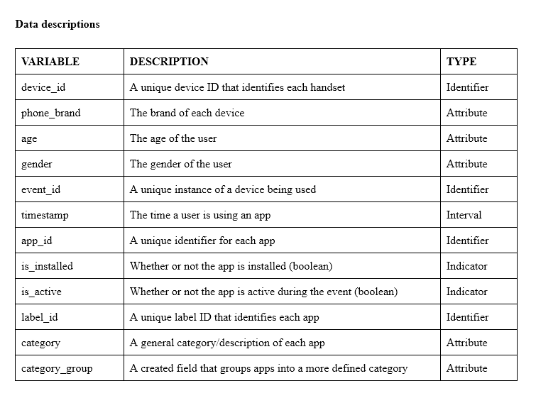

# Capstone
---------------------------------------------------------------------------------------------------------------------
# 1. Capstone Project

## Predicting User Demographics Based on Their Mobile Device
In a highly competitive and populated market like China, every interaction between a brand and consumer is crucial in creating a customer. Companies are now moving away from traditional methods of marketing to better understand and interact with their audience.

In this project, I will be predicting the demographics of users based on their app usage, geo-location, and mobile device properties. In doing so this will help millions of developers and brand advertisers around the world to pursue data-driven marketing efforts that are more accurate and relevant to the consumers preferences.

The Data has been collected from TalkingData SDK integrated within mobile apps. TalkingData is China’s largest third-party mobile data platform and is integrated in more than 70% of the 500 million mobile devices active daily in China.

## One Day in China

# 2. Data Structure

## The Data

## Data Dictionary

